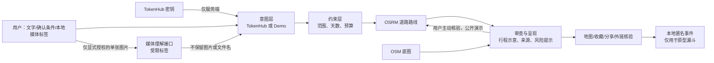

# 「去处 Somewhere」：从聊天式推荐到可审计的旅行决策 Agent

## 1. 一句话定位

这是一个面向短途旅行决策的 C 端原型：把用户模糊的旅行愿望转成可确认的约束，从编辑型目的地库中召回候选，展示编辑路线与可选的道路路线核验，并通过反馈与本地漏斗数据验证用户是否完成决策。

它不是“让大模型直接写一篇攻略”。模型在当前版本主要负责理解和结构化表达；候选、行程和风险提示来自本地编辑库，因此结果可复现、可解释，也不会把不确定信息伪装成事实。

## 2. 面试时如何回答：它和直接问 AI 有什么区别？

我会这样表述：

> 我没有把 LLM 当作攻略生成器，而是把它放进一个受约束的决策工作流。用户的自然语言先被解析为待确认意图；天数、范围、预算等硬约束必须由用户确认后才参与筛选；候选由结构化编辑库召回并排序；路线、来源和实时性边界在界面上可见。模型负责“理解与解释”，数据和规则层负责“可执行性与降级边界”。

| 直接问大模型 | 去处 Somewhere 的目标形态 |
| --- | --- |
| 输入是一段聊天，输出通常是一段文本 | 输入被拆成意图、偏好与硬约束，用户可逐项确认 |
| 推荐来源、筛选逻辑和时效不清晰 | 展示决策轨迹、数据状态、来源链接和“未实时核验”提示 |
| 每次回答可能不同，难以运营与评估 | 结构化候选和排序规则可以版本化、回放和做 A/B 测试 |
| 容易把实时价格、交通、营业状态编造得很像真的 | 把实时能力与静态示意明确分开，并预留验证层 |
| 结束于一段答案 | 继续支持地图浏览、收藏、分享、外链核验与反馈闭环 |

这不是说当前原型已经具备完整旅行交易能力；它的价值是验证“模糊旅行意图能否被转为可继续行动的决策过程”。

## 3. 当前已实现的真实能力

### 用户体验

- 自然语言委托、国内/海外、2/3/4 天、城市和预算等条件识别；文字识别出的条件不会静默生效，用户需要点击确认应用。
- 在配置可用时，通过 TokenHub 的 OpenAI 兼容接口解析旅行氛围；不可用时回退到本地 Demo，界面会标明状态而不阻塞演示。
- 静态编辑型目的地库的筛选、排序、候选比较和多日行程展示。
- 行程时间预算：规则层把停留、已列移动与显式换点缓冲组成每日 8 小时参考预算，输出留白/适中/偏紧/过满。它不声称实时交通或营业排程，而是让用户能看见行程的可执行性假设。
- MapLibre + OpenStreetMap 的交互地图：可在地图、候选卡和行程点之间联动。地图模块、worker 与样式只在用户点击“加载交互地图”后下载，避免阻塞候选结果；编辑路线始终可见。用户主动点击核验后，前端经 `/api/route` BFF **逐段顺序**取得道路路线、距离、预计时长、来源与规划时间，并显示第 n/m 段进度，以匹配公开 OSRM 的限速边界。地图初始化或底图失败时保留文本路线，提供重试与可见地点列表；该层有参数校验、超时、成功缓存、公开 OSRM 的 1 req/s 限速及 `OSRM_URL` 供应商切换点；公共端点仍仅可用于开发/公开演示。
- 每个行程 POI 都有按需“核对地图参照”入口：通过受控 BFF 查询 OpenStreetMap 的附近参照与来源链接，结果明确标为地理参照，而非“景点已验证”或营业事实；公共端点被限速、缓存并保留可替换路径。
- 出发前天气核验：用户选择日期后，通过 `/api/weather` BFF 按坐标查询 Open-Meteo 的日级天气编码、最高/最低温、最高降水概率与最大风速。服务端只返回所选日期所需字段，并有输入上限、12 秒超时和 10 分钟成功缓存；页面明确它不替代气象预警或出行安全判断。
- 本地图片与音频选择、预览、移除和播放。图片默认仅本地预览；只有用户先勾选明确授权、再点击“试验性分析”按钮，才会发送该单张图片到独立的受控媒体接口。服务端只将结果收敛为受限的结构化标签，不保留图片、文件名或原始媒体内容，也不会把图片偷偷并入文字意图请求。音频只在本地播放；用户可把听感手动写成文字偏好，音频本身不会上传、转写或语义分析。
- 图片理解使用可配置的 `TOKENHUB_MEDIA_MODEL`。TokenHub 的公开多模态协议列出图片和视频 URL；YT‑VITA 可理解视频中的画面和音频，未列出 MP3/M4A/WAV 直接输入，因此不能把本项目的音频预览称为音频 AI。当前账号的最小真实视觉请求曾出现上游拒绝或超时，因此这不是已被证明稳定可用的线上能力；部署前必须以目标账号、模型和区域完成权限、连通性、超时和质量验证。腾讯云模型能力以其[官方多模态理解文档](https://cloud.tencent.com/document/product/1823/130988)为准。
- 收藏、分享摘要、出发决策包、最近委托恢复和本地匿名行为漏斗。文字与结构化条件只保存在当前设备，刷新后恢复编辑状态但不会自动重新调用模型或恢复媒体。决策包可导出 Markdown，收拢每日 POI、地图入口、路线状态与待办；只有用户主动查询后才会携带该次天气预报与查询时间，不含原始委托、上传媒体、预订或价格信息。收藏会提炼为可撤回的本地偏好记忆，仅在满足范围、天数、预算等硬条件后，用可解释的加分重排候选；分析数据不发送到服务端，不记录自由文本或原始媒体。

### 工程与安全边界

- React + TypeScript + Vite，TokenHub 调用由开发服务器代理完成，浏览器端不持有密钥；代理优先读取 `TOKENHUB_API_KEY`，未配置时才兼容回退到本地 `key.md`。
- 开发服务仅绑定 `127.0.0.1`，并拦截 `key.md`、`.env*`、`.git` 的 HTTP 访问。
- 当前构建产物本身是静态前端；`/api/agent` 是 Vite 开发环境能力，不能被当作已上线的生产 API。

## 4. 架构与决策流

关键产品原则：

1. 将“推断”与“用户确认”区分。模型能猜测意图，但硬约束只有在用户确认后才能过滤结果。
2. 将“编辑事实”与“实时事实”区分。当前 POI 与提醒仍是编辑示例；道路路线可由 OSRM 公共演示端点按需核验，天气可按需查询 Open-Meteo 日级预报，但两者都不承诺生产 SLA 或安全事实。实时交通、营业、票务和签证必须接入可信数据源后再使用。
3. 将“生成内容”与“决策证据”区分。页面展示过程轨迹与数据状态，不展示模型私有思维链，也不把 UI 步骤伪装成已经调用过的工具。

## 5. 业务可行性评估

### 建议聚焦的 MVP

首先只做国内、2–4 天、城市周边/周末出行，面向“知道想要什么感觉，但不知道去哪”的用户。这个范围能避免签证、跨境支付、多币种、长距离交通组合等复杂度，验证核心假设：用户是否愿意从目的地导向转向“感受 + 约束”导向的决策方式。

### 用户价值与可能的业务闭环

- 降低决策疲劳：将开放式搜索压缩成可比较的 3–5 个候选。
- 提高信任：让用户看到哪些条件已生效、哪些信息尚未核验。
- 形成转化入口：当路线和 POI 接入可信来源后，可把地图外链、收藏、交通/门票/住宿比价作为后续跳转节点。
- 沉淀偏好：收藏、放弃、调整约束等反馈，可用于优化排序和内容供给，而不是只累计对话记录。

商业化在当前版本尚未验证。更合理的验证顺序是先验证“候选被打开/收藏/外链核验”的决策完成率，再评估联盟跳转、目的地内容合作或订阅式旅行偏好档案；不应在没有供给与转化数据时先假设交易收入。

## 6. 指标设计与实验方法

当前项目已有本地匿名事件账本，能在单机演示中记录 `brief_submitted`、`constraints_applied`、`candidates_viewed`、`destination_selected`、`itinerary_shared`、`decision_package_exported`、`navigation_opened`、`media_added`。它不是线上分析系统，不能用于真实经营结论。

正式试点时建议定义以下漏斗，并接入经同意的服务端分析：

| 层级 | 指标 | 说明 |
| --- | --- | --- |
| 输入质量 | 委托提交率、条件确认率 | 验证用户是否理解“感受 + 约束”的输入方式 |
| 决策效率 | 首次结果打开率、平均调整次数、完成决策耗时 | 对比普通搜索/自由聊天是否减少犹豫 |
| 信任 | 来源链接打开率、实时信息核验率、风险提示后的退出率 | 防止“好看但不可信”的推荐 |
| 行动 | 决策包生成率、收藏率、分享率、地图/供应商外链率 | 作为交易前的代理指标，不能等同预订 |
| 质量 | 无结果率、约束冲突率、推荐被明确拒绝率 | 反哺内容覆盖与排序规则 |

实验上应把“纯 LLM 对话”“静态目的地列表”“带确认和证据的决策流”作为对照。核心假设不是 LLM 文案更漂亮，而是第三种方案能在不牺牲信任的前提下提升候选打开和行动率。

## 7. 风险、缺口与应对

| 风险/缺口 | 当前事实 | 下一步应对 |
| --- | --- | --- |
| 数据时效 | 目的地 POI 与提醒为静态编辑示例；已可按需发现附近 OSM 地图条目，但其不是审核内容库 | 为每条审核 POI 加来源、更新时间、适用范围；将探索结果与审核库分层并接入真实 POI 服务 |
| 路线可靠性 | 已可按需通过 OSRM 公共演示端点核验每日道路路线；出发城市为上海/北京/广州/成都且选择自驾时，也可单独核验抵达段。公共端点不适合生产，也不支持公共交通、班次或票务 | 使用 BFF/签约地图服务或自托管 OSRM，接入班次供应商；保留距离、耗时、方式、来源、生成时间和失败降级 |
| 天气边界 | 已可按需查询 Open-Meteo 的日级预报；不含气象预警，也不是安全结论 | 接入适用地区的预警源，保留查询时间、地点、预警等级与降级提示 |
| 生产密钥 | 仅有 Vite 开发代理，优先读取环境变量、兼容回退本地 `key.md` | 部署云函数/BFF，使用平台密钥管理、限流、审计和密钥轮换 |
| 多模态理解 | 图片可在用户勾选授权并再次点击后送往独立接口，返回受限标签；当前账号最小真实视觉请求出现上游拒绝/超时，稳定性未获证明；音频仅本地播放，用户可手写听感但音频未上传/分析 | 在目标账号/模型/区域完成真实验收，设置超时、限流、删除与失败降级；若要理解声音，先选定有明确音频输入协议的转写服务，或改为受控上传、时长/格式校验的视频理解链路 |
| 个性化偏差 | 已有仅基于收藏结构化标签的本地、可清除偏好记忆；没有账号或在线训练 | 若建立跨设备档案，需单独授权、可导出/删除，并避免以敏感属性推断旅行偏好 |
| 大模型不稳定 | JSON 格式和内容可能异常 | Schema 校验、重试、超时、降级到可解释的规则结果 |
| 内容供给 | 静态库覆盖有限 | 优先深耕 20–50 个高质量城市/周边场景，建立编辑审核流程 |

## 8. 后续路线图

### 0–4 周：让原型可验证

- 部署真正的 `/api/agent` 服务，密钥迁出工作区；完善请求限流、日志脱敏和错误监控。
- 为显式授权的图片理解部署独立媒体接口，使用 `TOKENHUB_MEDIA_MODEL`，并以目标账号完成真实模型验收；音频不纳入该承诺。
- 补齐生产 BFF 的 API schema 校验、单元/端到端测试；现有地图已按需加载。
- 将静态库替换/补充为带来源、更新时间、适用季节与审核状态的真实 POI 内容数据。
- 按 [POI 内容运营契约](CONTENT_OPERATIONS.md) 建立 `draft → reviewed → retired` 的审核、复核与下线流程；先聚焦 20–50 个国内短途场景，而不是泛化覆盖。

### 1–2 个迭代：让推荐可执行

- 将 OSRM 演示核验迁移为 BFF、签约地图服务或自托管实例，并接入天气、营业时间等低风险事实源。
- 先支持国内城市内步行/公共交通的多日路线；当前 OSRM 仅覆盖步行/骑行/驾车道路网络，不覆盖公共交通，需明确数据源更新时间和失败提示。
- 建立“换一个、更安静、少走路、预算更低”等反馈信号，优化召回与排序。

### 后续：验证商业化，而非先堆功能

- 在用户授权下建立偏好档案和跨会话收藏。
- 对经核验的交通、住宿、活动接入跳转或比价，测量从建议到实际行动的转化。
- 仅在数据质量和售后边界准备充分后，评估预订闭环或目的地合作。

## 9. 可用于面试收尾的反思

这个项目最需要避免的误区，是把“接上模型”和“做成 Agent”画等号。当前版本已证明约束确认、偏好重排、按需道路路线核验，以及用户触发的附近 OSM 探索闭环；但后者不是审核 POI 供给。它仍未证明真实 POI 内容库、生产级路线可靠性和商业转化。我的下一步不是继续增加炫目的生成能力，而是把 BFF、真实数据来源、约束验证、失败降级和指标闭环做扎实；这些才是一个旅行决策产品从 Demo 走向可用服务的门槛。
