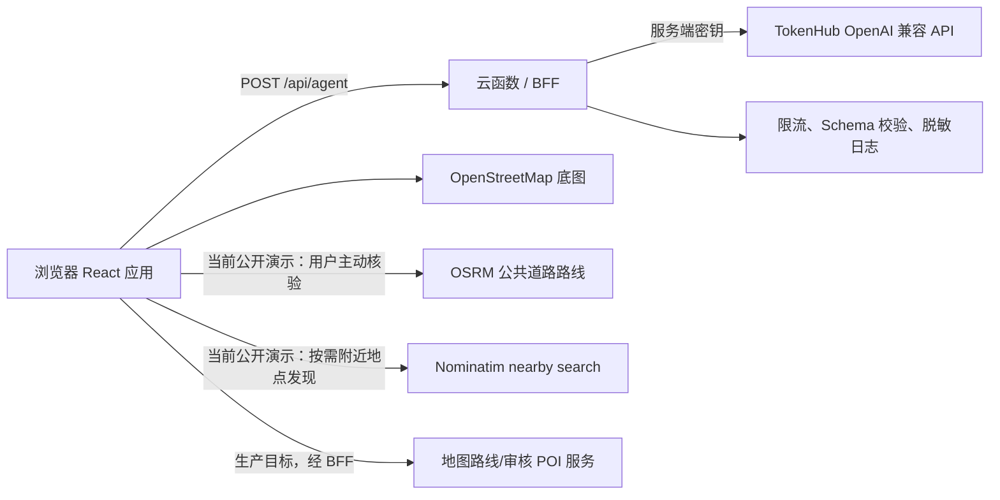

# 生产环境 API 可行性与接入契约

## 结论

当前项目的 `/api/agent` 在 Vite **开发服务器**中可用于本机演示 TokenHub 接入。`pnpm build && pnpm preview` 产出的静态站点不包含这个代理，因此不能直接视为可上线服务。仓库已提供 Vercel Node Function 薄适配示例，但它只是待部署代码，**不代表任何环境已经部署或对公网开放**。

生产化是可行的，但必须新增一个服务端运行时（云函数、BFF 或后端服务）承载该接口；TokenHub 密钥只能存在于服务端的密钥管理系统，不能继续以工作区文件、`VITE_*` 环境变量或浏览器请求携带。

## 当前与目标架构



浏览器只应向 `/api/agent` 提交用户自愿输入的文字与已确认条件。图片理解必须走独立媒体接口：默认不上传，用户需先勾选明确授权并再次点击分析操作，才发送该单张图片；图片绝不能被偷偷并入本接口。媒体处理服务只返回受限标签，不保留图片、文件名或原始媒体内容。音频仍只支持本地播放，未转写或分析。

当前账号的最小真实视觉请求曾发生上游拒绝或超时，尚未证明 TokenHub 视觉能力在该账号上稳定可用。因此下文是部署契约，不是上线可用性声明：部署前必须用目标账号、`TOKENHUB_MEDIA_MODEL`、目标区域完成真实连通性、模型权限、超时与输出质量验收。腾讯云的模型能力和可用模型应以[官方多模态文档](https://cloud.tencent.com/document/product/1729)及账号实际权限为准。

## 最小 API 契约（MVP）

### `POST /api/agent`

用途：将旅行委托解析为**意图建议**。它不负责实时地图导航、价格查询、库存或预订。

当前共享 BFF 核心的请求仅接受 `input`；产品侧的已确认约束应在前端用于候选筛选，不能作为未校验字段透传给模型。

请求：

```json
{
  "input": "想在国内找一个三天、安静、有海风、不要太商业化的地方"
}
```

服务端不得把模型识别出的值自动当成硬约束。`input` 限制为 1–2,000 个字符，请求体上限为 20KB，并在服务端做长度、类型与内容校验。`requestId` 由服务端生成，避免信任客户端提供的追踪 ID。

成功响应：

```json
{
  "profile": {
    "summary": "希望得到一个节奏缓慢、临海且安静的短途休息方案",
    "emotions": [{ "label": "安静", "score": 88 }],
    "environments": ["海边"],
    "pace": "慢速",
    "socialDensity": "独处为主",
    "climate": "未核验",
    "constraints": ["3 天"]
  },
  "meta": {
    "mode": "live",
    "provider": "tokenhub",
    "requestId": "...",
    "generatedAt": "2026-08-04T00:00:00.000Z"
  }
}
```

错误响应统一使用：

```json
{
  "error": {
    "code": "upstream_unavailable",
    "message": "智能解析服务暂不可用，请稍后重试。"
  },
  "meta": {
    "mode": "unavailable",
    "requestId": "...",
    "generatedAt": "2026-08-04T00:00:00.000Z"
  }
}
```

当前错误码包括 `invalid_input`（400）、`method_not_allowed`（405）、`unsupported_media_type`（415）、`service_not_configured`（503）、`upstream_timeout`（504）和 `upstream_unavailable`（502）。不要向浏览器返回 TokenHub 原始错误正文、密钥片段或内部堆栈。

## Vercel Node Function 适配示例（待部署）

示例入口是 [`deploy/vercel/api/agent.mjs`](../deploy/vercel/api/agent.mjs)。它使用 Vercel Node Function 的 `req` / `res` 形式，关闭 Vercel 默认 body parser 后，将原始请求转换为 Fetch `Request`，交给唯一的共享核心 `createTokenHubAgentHandler({ env: process.env })`。它不会读取 `key.md`，不会向浏览器暴露密钥，也不会在前端包中写入 TokenHub Key。

在选择 Vercel 作为部署平台时，将该文件放入 Vercel 识别的 API Function 路径（或按你的仓库结构配置构建输出），并确保它和 `server/tokenhub-agent.mjs` 一同进入服务端部署产物。TokenHub Key 不放在 Vercel 或其他服务端环境变量中，而由用户在页面设置中提供：

| 变量 | 必填 | 用途 |
| --- | --- | --- |
| `TOKENHUB_BASE_URL` | 否 | 上游兼容接口根地址，默认 `https://tokenhub.tencentmaas.com` |
| `TOKENHUB_MODEL` | 否 | 模型别名，默认 `hy3` |
| `TOKENHUB_MEDIA_MODEL` | 否 | 已明确授权的图片理解模型；必须在目标账号上验证权限与稳定性 |

部署前可运行 `pnpm run test:vercel`。测试模拟 Node `req` / `res`，覆盖成功响应与 `405 + Allow: POST` 错误透传；不调用真实 TokenHub，也不需要真实密钥。实际部署仍需由项目所有者在 Vercel 中创建项目、配置环境变量和发布，当前仓库**尚未部署**。

## 服务端职责清单

1. 读取请求头中的用户会话 Key、`TOKENHUB_MODEL` 和 `TOKENHUB_MEDIA_MODEL`；网关固定为官方 TokenHub 地址。不读取项目根目录的 `key.md`，也不从服务端环境变量读取 TokenHub Key。
2. 验证请求 JSON、字符数、媒体字段策略和速率限制；文字接口限制单次 body 大小，例如 16 KB。图片接口应只接受显式授权的单张 JPG/PNG/WebP，独立限制请求体大小与超时，拒绝文件名、路径及未经允许的媒体类型。
3. 使用固定系统提示词和 JSON Schema/严格解析，校验 `summary`、情绪数组、分数范围等响应字段。
4. 设置连接与总超时，建议上游 8–12 秒；失败时返回可读错误，让前端明确展示“在线不可用/已降级”。
5. 记录最小化的观测信息：requestId、状态码、延迟、模型别名、错误类别。默认不记录原始旅行文本、图片、文件名、媒体内容或 API 响应全文；媒体接口仅向前端返回经收敛的受限标签。
6. 对同一匿名会话或 IP 做限流、WAF/机器人防护与成本上限；在接入登录前尤其重要。
7. 给前端返回 `meta.mode` 与数据时间，让 UI 不会把离线 Demo 或静态编辑数据标为实时。

## TokenHub 调用策略

生产服务端可沿用 OpenAI 兼容的 `/v1/chat/completions` 调用方式，但需要满足以下约束：

- API Key 由受控 BFF 从本次请求头读取后，以 `Authorization: Bearer ...` 发送；BFF 不持久化、不回显。
- 低温度、严格 JSON 输出，并对模型返回内容做 Schema 校验；不能仅用正则截取后直接信任。
- 将模型名配置化；模型权限或可用性变化时，服务端应能切换或关闭在线能力。
- 对上游错误做分类：认证/配额问题报警，临时网络错误短暂重试，内容解析失败直接降级而不是无限重试。
- 记录调用成本和请求量，但日志中不包含密钥与用户自由文本。

## 地图与路线能力的生产边界

当前 MapLibre + OpenStreetMap 用于地图展示，朱红线为编辑行程示意。用户主动点击核验时，前端会请求 OSRM 公共演示端点并在成功后叠加道路路线、距离、预计时长、来源和规划时间；失败时保留编辑路线并显示原因。该公开端点没有生产 SLA，不应承载线上流量，也不支持公共交通。以下能力仍需以受控服务和真实数据层实现后才能对用户承诺：

当临时仍需调用公共 OSRM 或 Nominatim 时，服务端可配置 `UPSTASH_REDIS_REST_URL` 与 `UPSTASH_REDIS_REST_TOKEN`。BFF 会以原子 Redis `SET key 1 NX PX 1000` 在所有函数实例间竞争每个公共上游的请求槽：获得槽才调用上游，未获得返回 `429 + Retry-After: 1`；一旦已配置的共享保护层不可用，则返回可读 `503`，不会绕过保护层。未配置时仅保留本地开发的进程内限流，不能当作生产多实例保护。该机制是公共演示服务的安全护栏，不替代迁移到签约或自托管供应商。

| 能力 | 需要的真实数据/服务 | 页面必须展示的边界 |
| --- | --- | --- |
| 真实 POI 搜索、营业状态 | Places/POI 服务、官方来源 | 来源、更新时间、不可用时的降级 |
| 生产级步行/驾车/公交路线 | BFF 后的签约路径规划服务或自托管 OSRM | 距离、预计时长、交通方式、生成时间 |
| 天气与预警 | 气象服务 | 数据时间、适用地点、预警等级 |
| 价格与库存 | 合规供应商接口 | 抓取/报价时间、币种、跳转后的价格差异 |
| 国际出行 | 签证、跨境交通、支付与合规规则 | 国家/地区、更新时间、需以官方信息为准 |

推荐先构建覆盖国内城市的真实 POI 数据层，再经 BFF 接入地图服务，完成“POI -> 路线 -> 时间/距离 -> 失败降级”的闭环，再考虑跨境与交易能力。

当前已提供一个更窄的过渡能力：`POST /api/poi-verification` 只在用户点击“核对地图参照”后，以 POI 名称和坐标查询 Nominatim reverse API，并返回“附近地图参照”、距离、OSM 链接与查询时间。它不等价于 POI 身份、营业、预约、安全或可达性验证。公共 Nominatim 需配置稳定、可识别的 `NOMINATIM_USER_AGENT`，BFF 已做 1 req/s 串行限速和 7 天成功缓存；生产必须保留可切换的自托管/签约供应商路径并遵守其[使用政策](https://operations.osmfoundation.org/policies/nominatim/)。

`POST /api/poi-discovery` 是另一个更窄的按需能力：仅接受精确 JSON `{ query, coordinates }`，其中 `query` 只能是 `park`、`cafe`、`museum` 或 `viewpoint`，`coordinates` 为 `[lng, lat]`。用户点击后，BFF 以受限范围查询 Nominatim，并最多返回 5 个名称、类别、坐标、距查询中心的直线距离和 OSM 来源链接，结果按距离升序排序。它用于补充“附近还能探索什么”，不会自动写入行程，更不构成内容审核、POI 身份、营业、预约、安全或可达性验证；直线距离也不能替代道路距离或可达时间。接口有 4KB 请求上限、12 秒超时、10 分钟成功缓存与公共请求 1 req/s 串行限速；`NOMINATIM_USER_AGENT` 为必填。公开服务只适合低量演示，生产应切换自托管或签约服务并保留来源、更新时间与失败降级。

`POST /api/weather` 是另一个按需核验接口，只接受 `{ coordinates: [lng, lat], date: "YYYY-MM-DD" }`，从 Open-Meteo 选择并返回该日期的天气编码、最高/最低温、最高降水概率和最大风速。它有 2KB 请求上限、12 秒超时、最长 30 分钟（默认 10 分钟）的成功缓存，不转发上游原始响应，也不需要浏览器持有 API Key。它仅适用于出发前的日级参考；气象预警、安全和实时交通必须接入适用地区的专门来源。字段和可用日期范围以 [Open-Meteo 官方文档](https://open-meteo.com/en/docs) 为准。

## 部署与发布检查表

- [ ] 选择并配置云函数/BFF 平台，使用 `deploy/vercel/api/agent.mjs` 或等效适配器部署真实 `POST /api/agent`。
- [ ] 在平台密钥管理中配置 TokenHub 密钥；若旧密钥曾暴露或被放在工作区，先轮换。
- [ ] 将根目录 `key.md` 从生产镜像和发布物中排除；不允许使用 `VITE_` 前缀保存密钥。
- [ ] 配置 HTTPS、CORS 白名单、请求体上限、限流、超时与错误报警。
- [ ] 对输入和上游输出引入 runtime schema 校验，并覆盖失败、超时、空结果与格式异常测试。
- [ ] 图片理解保持“勾选授权 + 二次点击”后才上传的交互；仅接收单张 JPG/PNG/WebP，响应仅含受限标签，不存储图片或文件名。
- [ ] 使用目标账号、`TOKENHUB_MEDIA_MODEL` 和目标区域执行最小真实视觉验收；当前账号已出现上游拒绝/超时，未通过稳定性验收前不得将图片理解标为可用。音频分析不在当前发布范围。
- [ ] 前端根据 `meta.mode` 明确显示在线、演示或不可用，不能静默假装在线。
- [ ] 为 POI、路线、天气等未来数据展示来源与更新时间；无法核验时禁用强事实表述。
- [ ] 配置 `NOMINATIM_USER_AGENT` 并确认公开服务用量符合政策；流量增长后切换自托管或签约地理服务。
- [ ] 如果公共 OSRM/Nominatim 在多实例环境中仍被使用，在平台密钥管理中配置 `UPSTASH_REDIS_REST_URL` 和 `UPSTASH_REDIS_REST_TOKEN`，并以并发请求验证全局最多一条请求/秒。
- [ ] 将 `poi-discovery` 的探索结果与审核 POI 库严格分层；不得把 Nominatim 搜索结果自动入库、自动加入行程或写成营业事实。
- [ ] 用真实 POI 数据（地点 ID、坐标、来源 URL、更新时间、审核状态）替换仅编辑型地点库；内容变更不应依赖前端发版。
- [ ] 将 OSRM 公共演示调用迁移到 BFF、签约地图服务或自托管实例；限制来源、配额、超时、缓存与滥用风险，公共交通单独接入可用供应商。
- [ ] 在灰度环境用匿名合成数据压测延迟、错误率、成本与降级比例后再放量。

## 现实可行性与投入判断

对“文字意图解析 + 静态内容召回”而言，云函数/BFF 的工程量较小，适合作为第一阶段；真正耗时的是内容结构化、数据授权、路线质量、实时性核验和售后/合规，而不是模型调用本身。

因此上线判断不应以“接口能返回文本”为标准，而应至少满足：密钥不出端、错误可降级、内容可追溯、实时信息有来源、用户能理解建议的适用边界。达到这些条件前，产品应以“旅行灵感与决策辅助”而非“准确行程/预订服务”对外表述。
